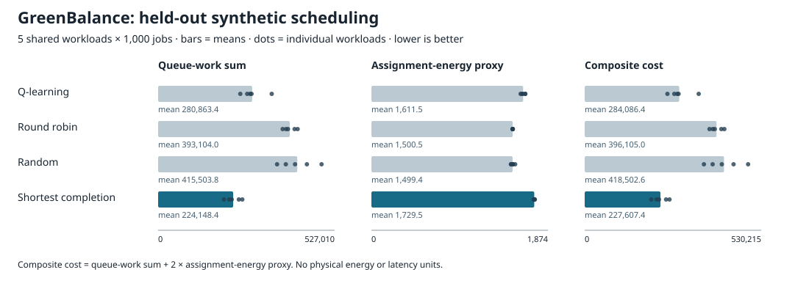

# GreenBalance

A small, reproducible experiment in energy-aware scheduling: route synthetic jobs
to three servers using tabular Q-learning and compare it with simple policies.
The maintained implementation is [greenbalance.py](greenbalance.py); NumPy is its
only external dependency.

## Run a quick experiment

Python 3.12 is the CI target.

```bash
python3 -m venv .venv
. .venv/bin/activate
python -m pip install -r requirements.txt
python greenbalance.py
python -m unittest discover -s tests -v
```

The default run trains on 100 different 200-job traces and evaluates on three
held-out traces. It is a fast demonstration, not a tuned learning result:
Q-learning performs worse than all three baselines at this small budget.
To save full per-seed results and reproduction metadata:

```bash
python greenbalance.py --output demo-results.json
```

Output files must be new. Run `python greenbalance.py --help` for job counts,
training episodes, workload seeds, policy seeds, and the energy weight. Training
is capped at five million transitions to keep accidental large runs bounded.

## What the model measures

Each time step adds one job to a chosen server, then all three servers process
their queues in parallel. Default service rates are 3, 2, and 1 work units per
step; assignment-energy costs are 2, 1.5, and 1 proxy units per routed job.

`step cost = remaining queued work + 2 × assignment-energy proxy`

The experiment records the sum of remaining queued work, assignment-energy
proxy, total composite cost, and backlog after the last arrival. Smaller costs
are better. These quantities are not measured electricity, actual job latency,
or operational cost. The model does not drain queues after the final arrival.

Workloads retain the original quiet/busy/mixed phases: approximately 30% of jobs
have sizes 1–3, 40% have sizes 5–10, and the rest have sizes 1–8. Busy arrivals
average 7.5 units per step, exceeding the cluster's total service rate of 6, so
backlog during this phase is unavoidable.

## Policies and evaluation

- **Q-learning:** original queue bins `[10, 20, 40]` (four buckets per server),
  job size, and epsilon-greedy learning. Evaluation chooses the first server on
  exact value ties, including unseen states, without changing the Q-table.
- **Round robin:** cycle through the three servers.
- **Random:** uniform assignments from an independent seed-specific stream.
- **Shortest predicted completion:** minimize `(queued work + job size) / speed`.
  This useful queue-aware baseline does not explicitly optimize energy.

Training uses a different workload seed each episode. Evaluation workload seeds
must be disjoint from training seeds, and every policy receives exactly the same
arrivals for each seed. Local random generators isolate workload generation,
learning, and random-baseline actions. Results include configuration and source
SHA-256 hashes, arrival hashes, Python/NumPy versions, and per-seed metrics.

The held-out traces come from the same synthetic phase distribution as training.
This checks new random job sequences, not generalization to other arrival
patterns. Aggregate standard deviations describe variation across workload
seeds for one trained agent; they do not quantify variation across training runs.

## Recorded experiment

With 500 training traces and five held-out traces of 1,000 jobs, Q-learning
reduces mean composite cost by 28.3% versus round robin, but costs 24.8% more
than the shortest-completion heuristic. That heuristic wins on every held-out
trace. Q-learning also uses a higher assignment-energy proxy than round robin.

| Policy | Mean queue-work sum | Mean assignment-energy proxy | Mean composite cost |
| --- | ---: | ---: | ---: |
| Q-learning | 280,863.4 | 1,611.5 | 284,086.4 |
| Round robin | 393,104.0 | 1,500.5 | 396,105.0 |
| Random | 415,503.8 | 1,499.4 | 418,502.6 |
| Shortest completion | 224,148.4 | 1,729.5 | 227,607.4 |



See [VALIDATION.md](VALIDATION.md) for commands, statistical limits, and tests,
and [the JSON record](results/held_out.json) for exact configuration and per-seed
results. These results support a comparison within this simulator, not a claim
that reinforcement learning is generally the best scheduling method.

## Original work and historical results

Junzhe Zong's original project lives at
[sonnenwendnacht/GreenBalance](https://github.com/sonnenwendnacht/GreenBalance).
The [original notebook](proj.ipynb) and [report](greenbalance.pdf) are preserved
unchanged from commit `0045e6b66a76c78cae34775b15f8240fb941b7a1`.

The report's roughly 40% improvement refers to its original **in-sample,
synthetic composite cost** comparison with random and round robin. It is a
historical result, not a result from this maintained experiment. The report's
references to operational cost or energy savings should be read with the proxy
model limitations above. No production deployment or physical energy saving is
demonstrated here.

The maintained version adds explicit terminal handling, configurable workload
length, varied training traces, held-out evaluation, the queue-aware baseline,
tests, and reproducibility metadata. No license has been added; this repository
does not grant a new open-source license.
